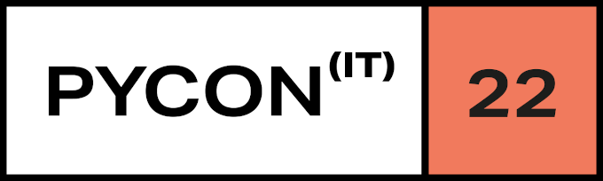
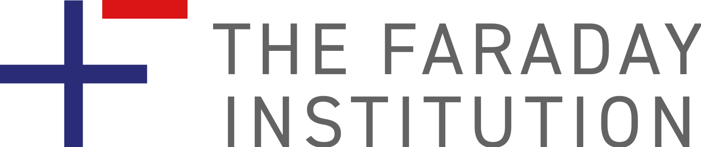
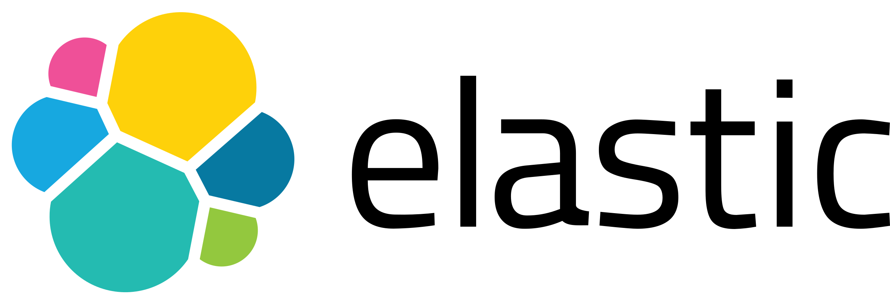
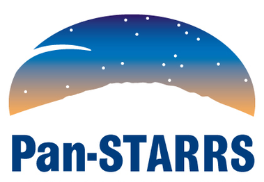

<table>
  <colgroup>
       <col span="1" style="width: 70%;">
       <col span="1" style="width: 30%;">
  </colgroup>
  <tr>
    <td>
      <h3><a href="https://www.mitacs.ca/en/programs/globalink/globalink-research-internship">Mitacs Globalink Research Award (~2000 recipients worldwide)</a></h3>
      <h5><a href="https://www.mitacs.ca/en#/">Mitacs</a> + <a href="http://www.shastriinstitute.org">Government of India (Shastri Indo-Canadian Institute)</a></h5>
    </td>
    <td style="text-align: center"></td>
    <td></td>
  </tr>
</table>

 

<table>
  <colgroup>
       <col span="1" style="width: 70%;">
       <col span="1" style="width: 30%;">
  </colgroup>
  <tr>
    <td>
      <h3>Grant to lead a talk virtually</h3>
      <h5><a href="https://tw.pycon.org/2022">10th Annual Conference on Python - Asia-Pacific (PyCon APAC)</a></h5>
    </td>
    <td style="text-align: center"></td>
    <td></td>
  </tr>
</table>

 

<table>
  <colgroup>
       <col span="1" style="width: 75%;">
       <col span="1" style="width: 25%;">
  </colgroup>
  <tr>
    <td>
      <h3><a href="https://www.linuxfoundation.org/about/lift-scholarships" target="_blank">Shubhra Kar Linux Foundation Training Scholarship (500 recipients worldwide)</a></h3>
      <h5><a href="https://www.linuxfoundation.org">The Linux Foundation</a></h5>
    </td>
    <td style="text-align: center"></td>
    <td></td>
  </tr>
</table>

 

<table>
  <colgroup>
       <col span="1" style="width: 75%;">
       <col span="1" style="width: 25%;">
  </colgroup>
  <tr>
    <td>
        <h3>Grant to lead a talk in-person</h3>
      <h5><a href="https://ep2022.europython.eu/">21st Annual Conference On Python - Europe (EuroPython)</a></h5>
    </td>
    <td style="text-align: center"></td>
    <td></td>
  </tr>
</table>

 

<table>
  <colgroup>
       <col span="1" style="width: 75%;">
       <col span="1" style="width: 25%;">
  </colgroup>
  <tr>
    <td>
        <h3>Grant to lead a 4 hour workshop in-person</h3>
      <h5><a href="https://pycon.it/en/">21st Annual Conference On Python - Italy</a></h5>
    </td>
    <td style="text-align: center"></td>
    <td></td>
  </tr>
</table>

 

<table>
  <colgroup>
       <col span="1" style="width: 75%;">
       <col span="1" style="width: 25%;">
  </colgroup>
  <tr>
    <td>
      <h3><a href="https://www.faraday.ac.uk/awards-winners-2021" target="_blank">Faraday Institution’s Collaboration Award</a></h3>
      <h5><a href="https://www.faraday.ac.uk">The Faraday Institution</a></h5>
    </td>
    <td style="text-align: center"></td>
    <td></td>
  </tr>
</table>

 

<table>
  <colgroup>
       <col span="1" style="width: 75%;">
       <col span="1" style="width: 25%;">
  </colgroup>
  <tr>
    <td>
      <h3><a href="https://devpost.com/software/memetastic" target="_blank">Won a hackathon organised by Elastic</a></h3>
      <h5><a href="https://www.elastic.co">Elastic</a></h5>
    </td>
    <td style="text-align: center"></td>
    <td></td>
  </tr>
</table>

 

<table>
  <colgroup>
       <col span="1" style="width: 75%;">
       <col span="1" style="width: 25%;">
  </colgroup>
  <tr>
    <td>
      <h3>Discovered an asteroid having a fixed orbit around Sun by analyzing astronomical data</h3>
      <h5><a href="http://iasc.cosmosearch.org">International Astronomical Search Campaign</a></h5>
    </td>
    <td style="text-align: center"></td>
    <td></td>
  </tr>
</table>
