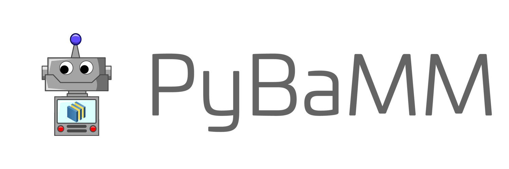
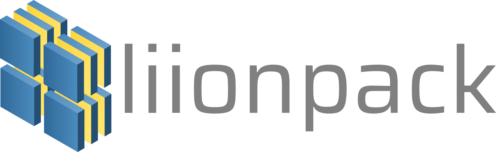

My contributions are scattered all over GitHub. I usually contribute to research software written in Python and Julia, but I am exploring the C/C++ side as well. Here are some of my significant contributions.

## Maintainer

---

### [PyBaMM (Python Battery Mathematical Modeling)](https://github.com/pybamm-team/PyBaMM)

<table>
  <colgroup>
       <col span="1" style="width: 65%;">
       <col span="1" style="width: 35%;">
  </colgroup>
  <tr>
    <td style="text-align:justify; padding-bottom: 20px; padding-right: 30px">PyBaMM (Python Battery Mathematical Modelling) solves physics-based electrochemical DAE models by using state-of-the-art automatic differentiation and numerical solvers.    
    I started working with PyBaMM's team during my time as a Google Summer of Code developer. The team was very welcoming and inclusive; hence, I decided to continue working with them after the program ended! I am not very well versed in the mathematical modeling of batteries; therefore my main contributions revolve around bug fixes, adding utility features, and maintaining the infrastructure.    
    Over the past few months, my contributions have mostly shifted towards the packaging, infrastructure, and CI/CD pipeline side of PyBaMM. I do wish to continue contributing new features to the PyBaMM repository.
  </td>
    <td></td>
    <td></td>
  </tr>
</table>

### [BattBot](https://github.com/pybamm-team/BattBot)

<table>
  <colgroup>
       <col span="1" style="width: 65%;">
       <col span="1" style="width: 35%;">
  </colgroup>
  <tr>
    <td style="text-align:justify; padding-bottom: 20px; padding-right: 30px">An automated Twitter Bot that Tweets random Battery Simulations and replies to requested Battery Simulations.    
    BattBot was my Google Summer of Code project. The project started as a stand-alone repository and is still running on the same good old infrastructure! The bot's codebase is well documented but it can be a bit confusing sometimes. The bot is partially deployed on Heroku and partially on GitHub Actions (yes, confusing). You can find it tweeting battery simulations on Twitter twice a day!    
    Everything in the bot was built from scratch by me, under the guidance of my mentors. I still maintain the bot, which includes fixing bugs, adding features, and fixing documentation.
  </td>
    <td></td>
    <td></td>
  </tr>
</table>

### [Vector](https://github.com/scikit-hep/vector)

<table>
  <colgroup>
       <col span="1" style="width: 65%;">
       <col span="1" style="width: 35%;">
  </colgroup>
  <tr>
    <td style="text-align:justify; padding-bottom: 20px; padding-right: 30px">Vector is a Python 3.6+ library for 2D, 3D, and Lorentz vectors, especially arrays of vectors, to solve common physics problems in a NumPy-like way.    
    In-progress.

  </td>
    <td></td>
    <td></td>
  </tr>
</table>

## Core-contributor

---

### [liionpack](https://github.com/pybamm-team/liionpack)

<table>
  <colgroup>
       <col span="1" style="width: 65%;">
       <col span="1" style="width: 35%;">
  </colgroup>
  <tr>
    <td style="text-align:justify; padding-bottom: 20px; padding-right: 30px">liionpack takes a 1D PyBaMM model and makes it into a pack. You can either specify the configuration e.g. 16 cells in parallel and 2 in series (16p2s) or load a netlist.    
    Before liionpack's initial release, I worked extensively on its documentation, infrastructure, and CI/CD pipeline. As a result, Liionpack's paper, published in the Journal of Open Source Software, now lists me as a co-author!!   
    I still look after liionpack's documentation, infrastructure, and CI/CD pipeline!

  </td>
    <td></td>
    <td></td>
  </tr>
</table>

### [FluxML](https://github.com/FluxML/Flux.jl)

<table>
  <colgroup>
       <col span="1" style="width: 65%;">
       <col span="1" style="width: 35%;">
  </colgroup>
  <tr>
    <td style="text-align:justify; padding-bottom: 20px; padding-right: 30px">Flux is an elegant approach to machine learning. It's a 100% pure-Julia stack, and provides lightweight abstractions on top of Julia's native GPU and AD support. Flux makes the easy things easy while remaining fully hackable.    
    In-progress.

  </td>
    <td></td>
    <td></td>
  </tr>
</table>

<!-- ## Contributor

---

### [FluxML](https://github.com/FluxML/Flux.jl)

<table>
  <colgroup>
       <col span="1" style="width: 65%;">
       <col span="1" style="width: 35%;">
  </colgroup>
  <tr>
    <td style="text-align:justify; padding-bottom: 20px; padding-right: 30px">Flux is an elegant approach to machine learning. It's a 100% pure-Julia stack, and provides lightweight abstractions on top of Julia's native GPU and AD support. Flux makes the easy things easy while remaining fully hackable.    
    In-progress.

  </td>
    <td></td>
    <td></td>
  </tr>
</table> -->

<!-- pages/projects.md -->
<!-- 

 -->
  <!-- Display categorized projects -->
  <!-- 
  <h2 class="category">{{ category }}</h2>
  
   -->
  <!-- Generate cards for each project -->
  <!-- 
  

    

    
      
    
    

  

  
  

    
      
    
  

  
  

 -->
<!-- Display projects without categories -->
  <!--  -->
  <!-- Generate cards for each project -->
  <!-- 
  

    

    
      
    
    

  

  
  

    
      
    
  

  


 -->
