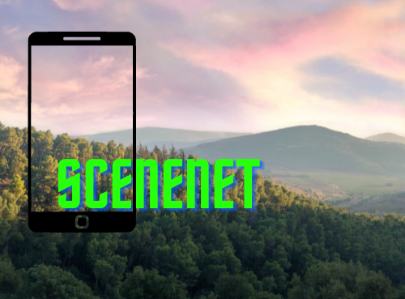

### [releaseup](https://github.com/Saransh-cpp/ForMente){:target="_blank"}
Natural Language Processing, Summarisation, spaCy, Scikit-learn, TF-IDF, Python library, MkDocs, ReadTheDocs, GitHub Actions, CI/CD

<table>
  <colgroup>
       <col span="1" style="width: 65%;">
       <col span="1" style="width: 35%;">
  </colgroup>
  <tr>
    <td style="text-align:justify; padding-bottom: 20px; padding-right: 30px">An extractive NLP approach for generating release notes from comments and docstrings added between two git tags.    
    releaseup extracts all the comments and docstrings using git diff, preprocesses the outputs, and finally generates release notes using sklearn's TfidfVectorizer and spacy! The generated release notes are not at all abstractive, which is something releaseup aims to achieve in the future.    
    The <a src="https://pypi.org/project/releaseup/" target="_blank">Python library</a> has 10+ installs on PyPI, 5+ stars on <a src="https://github.com/Saransh-cpp/releaseup" target="_blank">GitHub</a>, and follows best development practices.
  </td>
    <td style="text-align: center"></td>
    <td></td>
  </tr>
</table>

 

### [OCRed](https://ocred.readthedocs.io/){:target="_blank"}
Optical Character Recognition, Computer Vision, Tesseract-OCR, NLTK, Python library, MkDocs, ReadTheDocs, GitHub Actions, CI/CD

<table>
  <colgroup>
       <col span="1" style="width: 65%;">
       <col span="1" style="width: 35%;">
  </colgroup>
  <tr>
    <td style="text-align:justify; padding-bottom: 20px; padding-right: 30px">OCRed (pronounced as OCR'd) provides clever, simple, and intuitive wrapper functionalities for OCRing specific text material.    
    You don't want to learn OCR or the libraries that will help you perform OCR, but you need to OCR something? This friendly neighborhood library hides all of that stuff under simple functions like ocr_meaningful_text(). In other words, instead of manual preprocessing, looking for an OCR library, learning the library, then finally getting what you were looking for, use OCRed instead.    
    The <a src="https://pypi.org/project/ocred/" target="_blank">Python library</a> has 1,400+ installs on PyPI, 10+ stars on <a src="https://github.com/Saransh-cpp/OCRed" target="_blank">GitHub</a>, and follows best development practices.
  </td>
    <td style="text-align: center"></td>
    <td></td>
  </tr>
</table>

 

### [ForMente](https://github.com/Saransh-cpp/ForMente){:target="_blank"}
Natural Language Processing, Android, Dart, Flutter, Python, FastAPI, Firebase, Firestore, Heroku, GitHub Actions, CI/CD

<table>
  <colgroup>
       <col span="1" style="width: 65%;">
       <col span="1" style="width: 35%;">
  </colgroup>
  <tr>
    <td style="text-align:justify; padding-bottom: 20px; padding-right: 30px">By harnessing the power of Natural Language Processing, ForMente lets you diagnose what you are feeling in the form of a safe and secure personal diary.    
    ForMente is a personal diary built using Flutter and Dart that allows users to write down their minds every day. These texts are stored securely in Firestore, and users can visit them whenever they want. The application runs natural language processing on the texts written by a user and shows them how they are feeling in real-time using an API deployed on Heroku. This API has been developed using FastAPI and it hosts the trained Naive Bayes model for emotion classification.    
    The first person that someone usually talks to about their mental health is themselves. This usually buries the person with self-doubt that becomes hard to cure. ForMente comes in between to diagnose a person's feelings through Natural Language Processing. 
  </td>
    <td style="text-align: center"></td>
    <td></td>
  </tr>
</table>

 

### [ChaoticEncryption.jl](https://github.com/Saransh-cpp/ChaoticEncryption.jl){:target="_blank"}
Julia Package, ODEs, Pseudo-Random Number Generators, Encryption-Decryption

---

<table>
  <colgroup>
       <col span="1" style="width: 65%;">
       <col span="1" style="width: 35%;">
  </colgroup>
  <tr>
    <td style="text-align:justify; padding-bottom: 20px; padding-right: 30px">ChaoticEncryption.jl is a Julia package that comes loaded with Pseudo-Random Number Generators and various encryption techniques, which can be used to encrypt and decrypt any image file. The package is under active development, but the existing API is stable and might not change significantly.    
    The algorithms, with the help of Julia's optimisation techniques and multiple dispatch, have been vectorised to run 5-10 times faster than ordinary nested-for implementations. The package can be installed using Julia's package manager Pkg.jl -  
    <code> julia> ] add ChaoticEncryption </code>    
    The complete infrastructure, documentation, code, and CI/CD pipeline of the package have been built/written by me. The package has been starred 23 times on <a href="https://github.com/Saransh-cpp/ChaoticEncryption.jl">GitHub</a> and is available on JuliaHub <a href="https://juliahub.com/ui/Packages/ChaoticEncryption/dtMkN">here</a> (11 downloads). The documentation for the package is hosted by GitHub Pages and is available <a href="https://saransh-cpp.github.io/ChaoticEncryption.jl/stable">here</a> (stable/latest tagged version).
  </td>
    <td></td>
    <td></td>
  </tr>
</table>

 

### [SceneNet](https://github.com/Saransh-cpp/SceneNet){:target="_blank"}
Transfer Learning, VGG19, Python, Flutter, Dart, FastAPI, Heroku

---

<table>
  <colgroup>
       <col span="1" style="width: 65%;">
       <col span="1" style="width: 35%;">
  </colgroup>
  <tr>
    <td style="text-align:justify; padding-bottom: 20px; padding-right: 30px">User-facing scenery detection using transfer learning. SceneNet allows a user to take a picture of their surrounding to know where they are (could be for fun, could be for emergency, could be for visually impaired people).    
    The app uploads the image file to <a href="https://github.com/Saransh-cpp/SceneNet-Backend">SceneNet_Backend</a>, which is trained, using transfer learning, on a dataset of 10,000+ indoor images.
    The API returns a specific category which is then either, only displayed, or, displayed and spoken (text to speech).
    The user can easily select if they want the app to speak or not.
  </td>
    <td style="text-align: center"></td>
    <td></td>
  </tr>
</table>

 

### [PopItUp](https://github.com/Saransh-cpp/PopItUp){:target="_blank"}
Android, Kotlin, Firebase, Firestore, Google Sceneform SDK, Google ARCore SDK

---

<table>
  <colgroup>
       <col span="1" style="width: 65%;">
       <col span="1" style="width: 35%;">
  </colgroup>
  <tr>
    <td style="text-align:justify; padding-bottom: 20px; padding-right: 30px">An Augmented Reality shooting game, built with Google ARCore SDK and Google Sceneform SDK.    
    The sceneform SDK was injected externally in the app (due to the deprecation) and hence, this repository has more Java code than the Kotlin code. A lot if changes were made to the sceneform SDK itself, to make it compatible with AndroidX and other new updates.    
    The game spawns 20 spheroids in the real world which the users can shoot with an AR bullet.
    LeaderBoard. It also provides a real-time leaderboard to all the users. FirestoreRecyyclerView is used to bind all the live data into a RecyclerView.
  </td>
    <td></td>
    <td></td>
  </tr>
</table>

 

### [MemeTastic](https://github.com/Saransh-cpp/MemeTastic){:target="_blank"}
Flutter, Dart, NodeJS, Elasticsearch, Kibana, CI/CD, Google Cloud, Reddit API, Ngram Analyser

---

<table>
  <colgroup>
       <col span="1" style="width: 65%;">
       <col span="1" style="width: 35%;">
  </colgroup>
  <tr>
    <td style="text-align:justify; padding-bottom: 20px; padding-right: 30px">Summon and search Reddit memes from anywhere and at anytime!   
    The Flutter application summons a random meme from the top 100 memes on the memes subreddit. The backend uses elasticsearch to achieve this and then the frontend displays it with a clean UI. A user can also search for any meme using any string, given that I have implemented the ngram analyzer, the user will automatically be prompted with various suggestions on the basis of the string they enter.    
    Finally, the user can also share these memes with anyone.
  </td>
    <td style="text-align: center"></td>
    <td></td>
  </tr>
</table>

 

<!-- pages/projects.md -->
<!-- 

 -->
  <!-- Display categorized projects -->
  <!-- 
  <h2 class="category">{{ category }}</h2>
  
   -->
  <!-- Generate cards for each project -->
  <!-- 
  

    

    
      
    
    

  

  
  

    
      
    
  

  
  

 -->
<!-- Display projects without categories -->
  <!--  -->
  <!-- Generate cards for each project -->
  <!-- 
  

    

    
      
    
    

  

  
  

    
      
    
  

  


 -->
