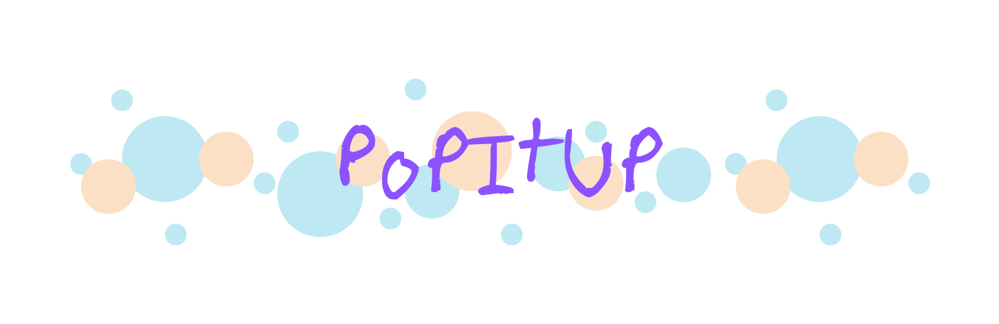

### ChaoticEncryption.jl 
Julia Package, ODEs, Pseudo-Random Number Generators, Encryption-Decryption

---

<table>
  <colgroup>
       <col span="1" style="width: 65%;">
       <col span="1" style="width: 35%;">
  </colgroup>
  <tr>
    <td style="text-align:justify; padding-bottom: 20px; padding-right: 30px">Encrypt and decrypt image files using Pseudo-Random Number Generators and various encryption techniques! ChaoticEncryption.jl is a Julia package that comes loaded with Pseudo-Random Number Generators and various encryption techniques, which can be used to encrypt and decrypt any image file. The package is under active development, but the existing API is stable and might not change significantly.    
    The algorithms, with the help of Julia's optimisation techniques and multiple dispatch, have been vectorised to run 5-10 times faster than ordinary nested-for implementations. The package can be installed using Julia's package manager Pkg.jl -  
    <code> julia> ] add ChaoticEncryption </code>    
    The complete infrastructure, documentation, code, and CI/CD pipeline of the package have been built/written by me. The package has been starred 23 times on <a href="https://github.com/Saransh-cpp/ChaoticEncryption.jl">GitHub</a> and is available on JuliaHub <a href="https://juliahub.com/ui/Packages/ChaoticEncryption/dtMkN">here</a> (11 downloads). The documentation for the package is hosted by GitHub Pages and is available <a href="https://saransh-cpp.github.io/ChaoticEncryption.jl/stable">here</a> (stable/latest tagged version).
  </td>
    <td></td>
    <td></td>
  </tr>
</table>

 

### SceneNet
Transfer Learning, VGG19, Python, Flutter, Dart, FastAPI, Heroku

---

<table>
  <colgroup>
       <col span="1" style="width: 65%;">
       <col span="1" style="width: 35%;">
  </colgroup>
  <tr>
    <td style="text-align:justify; padding-bottom: 20px; padding-right: 30px">User-facing scenery detection using transfer learning.    
  </td>
    <td></td>
    <td></td>
  </tr>
</table>

 

### PopItUp
Android, Kotlin, Firebase, Firestore, Google Sceneform SDK, Google ARCore SDK

---

<table>
  <colgroup>
       <col span="1" style="width: 65%;">
       <col span="1" style="width: 35%;">
  </colgroup>
  <tr>
    <td style="text-align:justify; padding-bottom: 20px; padding-right: 30px">An Augmented Reality shooting game, built with Google ARCore SDK and Google Sceneform SDK.    
  </td>
    <td></td>
    <td></td>
  </tr>
</table>

 

### MemeTastic
Flutter, Dart, NodeJS, Elasticsearch, Kibana, CI/CD, Google Cloud, Reddit API, Ngram Analyser

---

<table>
  <colgroup>
       <col span="1" style="width: 65%;">
       <col span="1" style="width: 35%;">
  </colgroup>
  <tr>
    <td style="text-align:justify; padding-bottom: 20px; padding-right: 30px">Summon and search Reddit memes from anywhere and at anytime!   
  </td>
    <td></td>
    <td></td>
  </tr>
</table>

 

<!-- pages/projects.md -->
<!-- 

 -->
  <!-- Display categorized projects -->
  <!-- 
  <h2 class="category">{{ category }}</h2>
  
   -->
  <!-- Generate cards for each project -->
  <!-- 
  

    

    
      
    
    

  

  
  

    
      
    
  

  
  

 -->
<!-- Display projects without categories -->
  <!--  -->
  <!-- Generate cards for each project -->
  <!-- 
  

    

    
      
    
    

  

  
  

    
      
    
  

  


 -->
