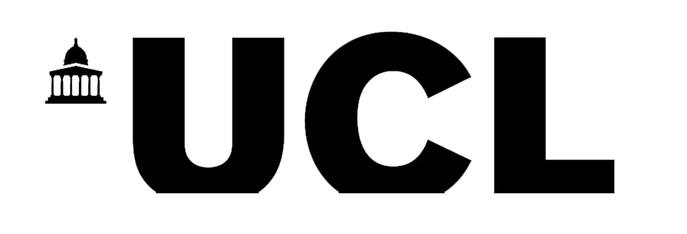
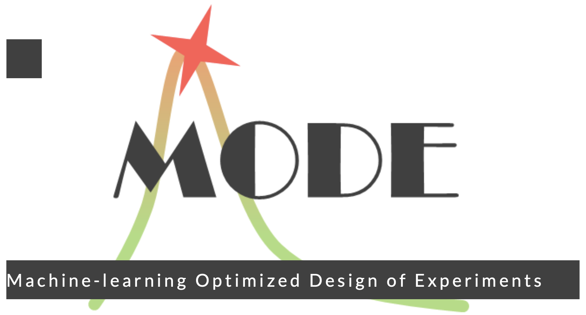
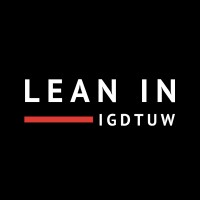
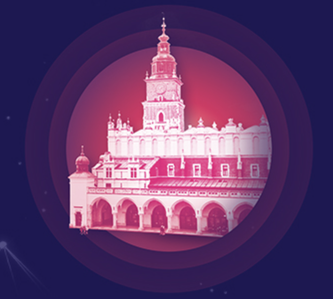
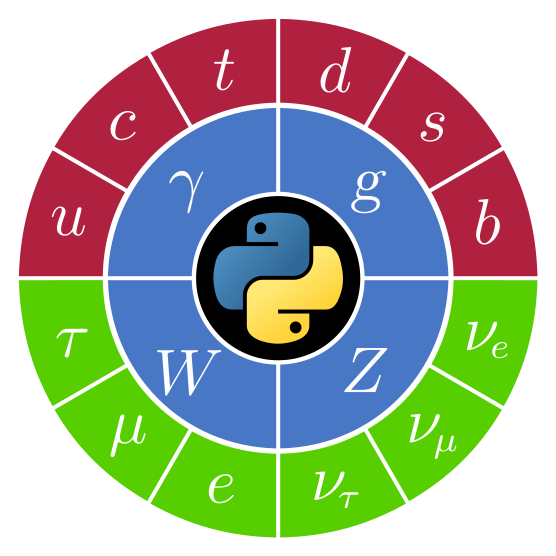
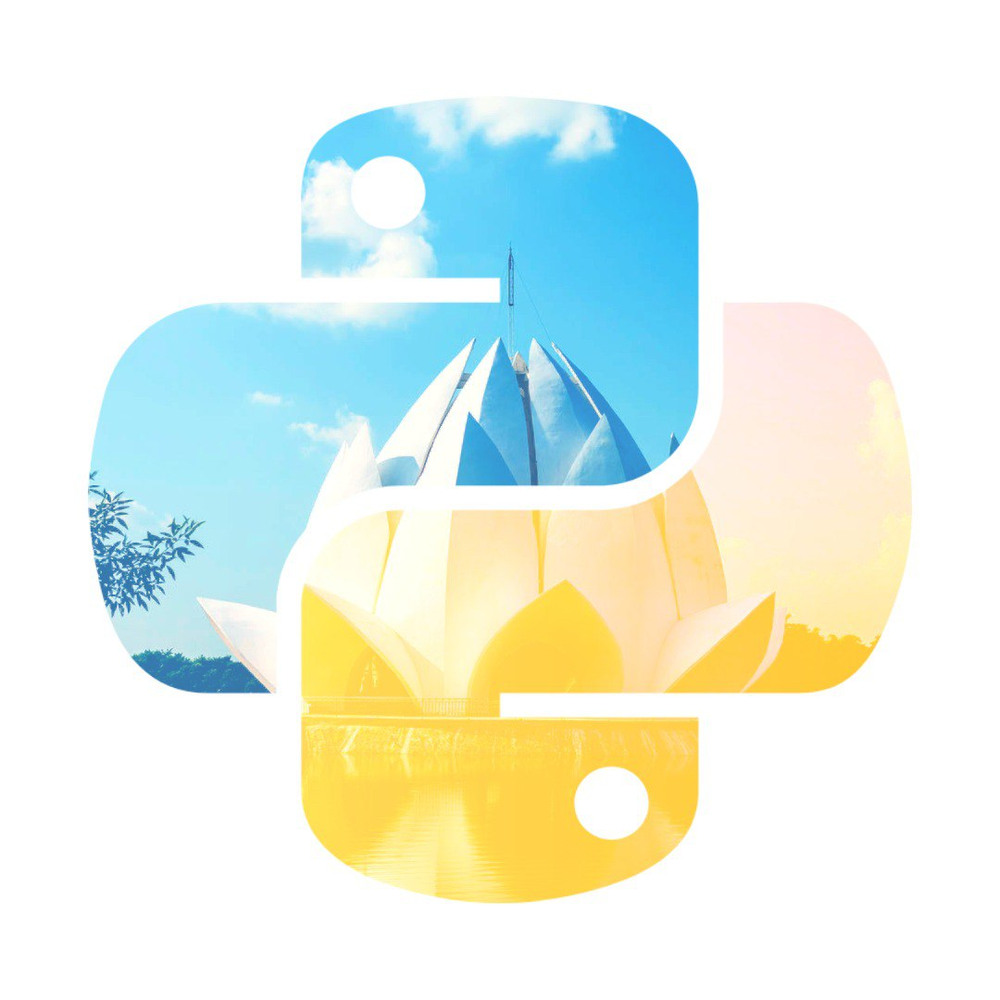
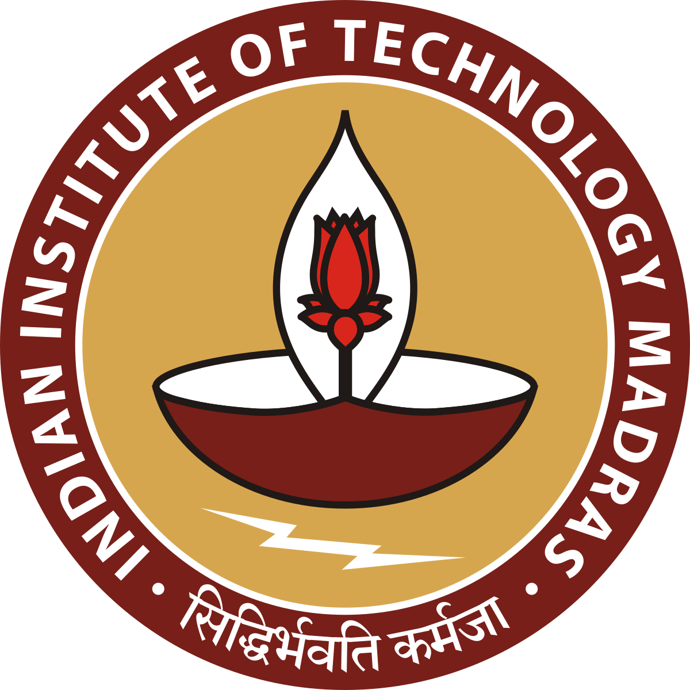

<table>
  <colgroup>
       <col span="1" style="width: 70%;">
       <col span="1" style="width: 30%;">
  </colgroup>
  <tr>
    <td>
      <h3><a href="https://github.com/UCL-ARC/good-first-issue-hackathons" target="_blank">First contribution to open-source software workshop [upcoming]</a></h3>
      <h5><a href="https://www.ucl.ac.uk/advanced-research-computing/events/2025/jul/festival-digital-research-innovation-scholarship">UCL Festival of Digital Research, Innovation & Scholarship 2025</a></h5>
    </td>
    <td style="text-align: center"></td>
    <td></td>
  </tr>
</table>

 

<table>
  <colgroup>
       <col span="1" style="width: 70%;">
       <col span="1" style="width: 30%;">
  </colgroup>
  <tr>
    <td>
      <h3><a href="https://github.com/UCL-ARC/python-tooling" target="_blank">python-tooling: transforming Python scripts into a Python package with good software engineering practices [upcoming]</a></h3>
      <h5><a href="https://www.ucl.ac.uk/advanced-research-computing/events/2025/jul/festival-digital-research-innovation-scholarship">UCL Festival of Digital Research, Innovation & Scholarship 2025</a></h5>
    </td>
    <td style="text-align: center"></td>
    <td></td>
  </tr>
</table>

 

<table>
  <colgroup>
       <col span="1" style="width: 70%;">
       <col span="1" style="width: 30%;">
  </colgroup>
  <tr>
    <td>
      <h3><a href="https://indi.to/8WZTS" target="_blank">Differentiable Computation with Awkward Array and JAX</a></h3>
      <h5><a href="https://indico.cern.ch/event/1481852/">5th MODE workshop on Differentiable Programming for Experiment Design</a></h5>
    </td>
    <td style="text-align: center"></td>
    <td></td>
  </tr>
</table>

 

<table>
  <colgroup>
       <col span="1" style="width: 70%;">
       <col span="1" style="width: 30%;">
  </colgroup>
  <tr>
    <td>
      <h3><a href="https://lu.ma/7odgx0q0" target="_blank">An introduction to scientific and high performance computing [invited]</a></h3>
      <h5><a href="https://www.linkedin.com/company/ieee-gu/">IEEE @ Galgotias University</a></h5>
    </td>
    <td style="text-align: center"></td>
    <td></td>
  </tr>
</table>

 

<table>
  <colgroup>
       <col span="1" style="width: 70%;">
       <col span="1" style="width: 30%;">
  </colgroup>
  <tr>
    <td>
      <h3><a href="https://indico.cern.ch/event/1457685/#3-saransh-chopra-computational" target="_blank">Computational upgrades to the high energy physics analysis pipeline for future LHC/HL-LHC runs </a><a href="https://www.youtube.com/watch?v=aVPhP_APhqw">🎥</a></h3>
      <h5><a href="https://iris-hep.org/">IRIS-HEP Topical Meeting (Gap Year Final Presentations)</a></h5>
    </td>
    <td style="text-align: center"></td>
    <td></td>
  </tr>
</table>

 

<table>
  <colgroup>
       <col span="1" style="width: 70%;">
       <col span="1" style="width: 30%;">
  </colgroup>
  <tr>
    <td>
      <h3><a href="https://www.linkedin.com/posts/lean-in-igdtuw_leanin-igdtuw-college-activity-7237792561896005632-W09w?utm_source=share&utm_medium=member_desktop" target="_blank">Fork & Fix: Open Source odyssey [invited]</a></h3>
      <h5><a href="https://linktr.ee/Lean_In__IGDTUW">Lean In @ Indira Gandhi Delhi Technical University for Women</a></h5>
    </td>
    <td style="text-align: center"></td>
    <td></td>
  </tr>
</table>

 

<table>
  <colgroup>
       <col span="1" style="width: 70%;">
       <col span="1" style="width: 30%;">
  </colgroup>
  <tr>
    <td>
      <h3><a href="https://indi.to/zTs5b" target="_blank">A new SymPy backend for vector: uniting experimental and theoretical physicists </a></h3>
      <h5><a href="https://indico.cern.ch/event/1338689/">27th International Conference on Computing in High Energy and Nuclear Physics</a></h5>
    </td>
    <td style="text-align: center"></td>
    <td></td>
  </tr>
</table>

 

<table>
  <colgroup>
       <col span="1" style="width: 70%;">
       <col span="1" style="width: 30%;">
  </colgroup>
  <tr>
    <td>
      <h3><a href="https://indi.to/pfTC6" target="_blank">A new SymPy backend for vector: uniting experimental and theoretical physicists </a><a href="https://www.youtube.com/watch?v=6x1kQy5cQlc&list=PLKZ9c4ONm-VnbQibz2OmG34T-q_0o1nxf&index=17">🎥</a></h3>
      <h5><a href="https://indico.cern.ch/event/1384010/">7th International Workshop on Python in High Energy Physics (PyHEP)</a></h5>
    </td>
    <td style="text-align: center"></td>
    <td></td>
  </tr>
</table>

 

<table>
  <colgroup>
       <col span="1" style="width: 70%;">
       <col span="1" style="width: 30%;">
  </colgroup>
  <tr>
    <td>
      <h3><a href="https://github.com/pydelhi/talks/issues/275" target="_blank">The scientific side of Python and Open-Source: using Python for High Energy Physics at CERN </a></h3>
      <h5><a href="https://www.meetup.com/pydelhi/events/301520830/">PyRustLin (PyDelhi X RustDelhi X India Linux User Group) Meetup</a></h5>
    </td>
    <td style="text-align: center"></td>
    <td></td>
  </tr>
</table>

 

<table>
  <colgroup>
       <col span="1" style="width: 75%;">
       <col span="1" style="width: 25%;">
  </colgroup>
  <tr>
    <td>
      <h3><a href="https://indico.cern.ch/event/1374922/#1-enabling-auto-differentiatio" target="_blank">Enabling auto-differentiation for the Scikit-HEP ecosystem</a></h3>
      <h5><a href="https://iris-hep.org/">IRIS-HEP Topical Meeting (Research Software Intern Talks)</a></h5>
    </td>
    <td style="text-align: center"></td>
    <td></td>
  </tr>
</table>

 

<table>
  <colgroup>
       <col span="1" style="width: 70%;">
       <col span="1" style="width: 30%;">
  </colgroup>
  <tr>
    <td>
      <h3><a href="https://indi.to/35ym5" target="_blank">What’s new with Vector? First major release is out! </a><a href="https://www.youtube.com/watch?v=JHEAb2R3xzE&list=PLKZ9c4ONm-VlAorAG8kR09ZqhMfHiH2LJ&index=10">🎥</a></h3>
      <h5><a href="https://indico.cern.ch/event/1252095/">6th International Workshop on Python in High Energy Physics (PyHEP)</a></h5>
    </td>
    <td style="text-align: center"></td>
    <td></td>
  </tr>
</table>

 

<table>
  <colgroup>
       <col span="1" style="width: 70%;">
       <col span="1" style="width: 30%;">
  </colgroup>
  <tr>
    <td>
      <h3><a href="#" target="_blank">Lessons learned while working as a Technical Writer at FluxML </a><a href="https://www.youtube.com/watch?v=ieAjBVUl0tg&list=PLP8iPy9hna6Q5tiN8gX1wMgBGdqRT_ZTE&index=17">🎥</a></h3>
      <h5><a href="https://juliacon.org/2023/">JuliaCon 2023</a></h5>
    </td>
    <td style="text-align: center"></td>
    <td></td>
  </tr>
</table>

 

<table>
  <colgroup>
       <col span="1" style="width: 70%;">
       <col span="1" style="width: 30%;">
  </colgroup>
  <tr>
    <td>
      <h3><a href="#" target="_blank">Open-source and open-source programs [invited] </a><a href="https://www.youtube.com/watch?v=x0j67m06X6s">🎥</a></h3>
      <h5><a href="https://community.cncf.io/events/details/cncf-noida-presents-gta-ghaziabad-lets-fork-together/">GTA Ghaziabad: Let's Fork Together</a></h5>
    </td>
    <td style="text-align: center"></td>
    <td></td>
  </tr>
</table>

 

<table>
  <colgroup>
       <col span="1" style="width: 70%;">
       <col span="1" style="width: 30%;">
  </colgroup>
  <tr>
    <td>
      <h3><a href="https://indico.cern.ch/event/1106990/contributions/4991358/" target="_blank">Compiling Awkward Lorentz Vectors with Numba</a></h3>
      <h5><a href="https://indico.cern.ch/event/1106990/">21st International Workshop on Advanced Computing and Analysis Techniques in Physics Research</a></h5>
    </td>
    <td style="text-align: center"></td>
    <td></td>
  </tr>
</table>

 

<table>
  <colgroup>
       <col span="1" style="width: 75%;">
       <col span="1" style="width: 25%;">
  </colgroup>
  <tr>
    <td>
      <h3><a href="https://indico.cern.ch/event/1195273/#5-saransh-chopra-vector-constr" target="_blank">Vector - Constructors, documentation, and benchmarks </a><a href="https://youtu.be/rjqnJbT7T1s?t=3134">🎥</a></h3>
      <h5><a href="https://iris-hep.org/">IRIS-HEP Topical Meeting (Fellows Final Presentation)</a></h5>
    </td>
    <td style="text-align: center"></td>
    <td></td>
  </tr>
</table>

 

<table>
  <colgroup>
       <col span="1" style="width: 70%;">
       <col span="1" style="width: 30%;">
  </colgroup>
  <tr>
    <td>
      <h3><a href="https://indico.cern.ch/event/1150631/contributions/5014393/" target="_blank">Constructing HEP vectors and analyzing HEP data using Vector </a><a href="https://www.youtube.com/watch?v=4iveMzrbe7s">🎥</a></h3>
      <h5><a href="https://indico.cern.ch/event/1150631/">5th International Workshop on Python in High Energy Physics (PyHEP)</a></h5>
    </td>
    <td style="text-align: center"></td>
    <td></td>
  </tr>
</table>

 

<table>
  <colgroup>
       <col span="1" style="width: 70%;">
       <col span="1" style="width: 30%;">
  </colgroup>
  <tr>
    <td>
      <h3><a href="https://github.com/pydelhi/talks/issues/215" target="_blank">Python packaging: from stone age to the future</a></h3>
      <h5><a href="https://pydelhi.org/">PyDelhi Meetup</a></h5>
    </td>
    <td style="text-align: center"></td>
    <td></td>
  </tr>
</table>

 

<table>
  <colgroup>
       <col span="1" style="width: 70%;">
       <col span="1" style="width: 30%;">
  </colgroup>
  <tr>
    <td>
      <h3><a href="https://tw.pycon.org/2022/en-us/conference/talk/243" target="_blank">Code coverage through unit tests running in sub-processes/threads: Locally and automated on GitHub </a><a href="https://www.youtube.com/watch?v=iSwvTDy_IKw&list=PLqtzN042QpfdkQbkOlwtEJMBGZHHsvimo&index=50">🎥</a></h3>
      <h5><a href="https://tw.pycon.org/2022">10th Annual Conference on Python - Asia-Pacific (PyCon APAC)</a></h5>
    </td>
    <td style="text-align: center"></td>
    <td></td>
  </tr>
</table>

 

<table>
  <colgroup>
       <col span="1" style="width: 75%;">
       <col span="1" style="width: 25%;">
  </colgroup>
  <tr>
    <td>
      <h3><a href="https://ep2022.europython.eu/session/code-coverage-through-unit-tests-running-in-sub-processes-threads-locally-and-automated-on-github" target="_blank">Code coverage through unit tests running in sub-processes/threads: Locally and automated on GitHub</a></h3>
      <h5><a href="https://ep2022.europython.eu/">21st Annual Conference On Python - Europe (EuroPython)</a></h5>
    </td>
    <td style="text-align: center"></td>
    <td></td>
  </tr>
</table>

 

<table>
  <colgroup>
       <col span="1" style="width: 75%;">
       <col span="1" style="width: 25%;">
  </colgroup>
  <tr>
    <td>
      <h3><a href="https://indico.cern.ch/event/1155138/#sc-1-9-saransh-chopra-vector-c" target="_blank">Vector - Constructors, documentation, and benchmarks </a><a href="https://youtu.be/fLt7BHuASpw?t=2627">🎥</a></h3>
      <h5><a href="https://iris-hep.org/">IRIS-HEP Topical Meeting (Fellows Lightning Talks)</a></h5>
    </td>
    <td style="text-align: center"></td>
    <td></td>
  </tr>
</table>

 

<table>
  <colgroup>
       <col span="1" style="width: 75%;">
       <col span="1" style="width: 25%;">
  </colgroup>
  <tr>
    <td>
      <h3>Introduction to Git and GitHub [invited] <a href="https://www.youtube.com/watch?v=d0oEVdmIzo0">🎥</a></h3>
      <h5><a href="https://www.iitm.ac.in">Indin Institute of Technology (IIT) Madras</a></h5>
    </td>
    <td style="text-align: center"></td>
    <td></td>
  </tr>
</table>

 

<table>
  <colgroup>
       <col span="1" style="width: 75%;">
       <col span="1" style="width: 25%;">
  </colgroup>
  <tr>
    <td>
      <h3><a href="https://www.pybamm.org/training" target="_blank">BattBot: Mathematical Modeling of Batteries using an automated Twitter bot </a><a href="https://youtu.be/WkkbrgP7Sss?t=1593">🎥</a></h3>
      <h5><a href="https://www.pybamm.org/">PyBaMM training workshop (advanced examples)</a></h5>
    </td>
    <td style="text-align: center"></td>
    <td></td>
  </tr>
</table>

 
